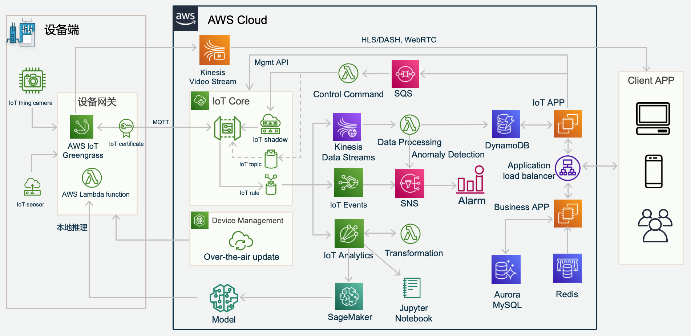

# IoT Workshop

IoT Workshop介绍在AWS IoT上的最佳实践，包括IoT Core的操作，创建IoT Thing和证书，IoT Device的消息发送和接收，IoT Device Shadow的消息操作，IoT Rule Engine的消息转发和IoT Greengrass的安装配置等。

IoT Workshop中包含了大量Python示例代码，方便开发参考。

AWS IoT的参考架构如下：

下面是workshop的实验步骤。
## 1. [Configure IoT Core](1.init.md)

## 2. [Create IoT Thing and Certificate, Sample Code for message publishing and subscription](2.create_iot_thing.md)

## 3. [Device Shadow Sample Code](3.device_shadow.md)

## 4. [Rule Engine Sample Code](4.create_rule_engine.md)

## 5. [Greengrass V2 Installation and Config](5.greengrass_v2_cn.md)
